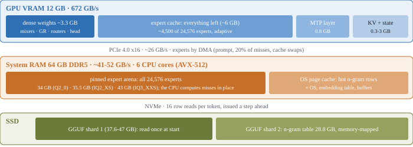

> [!NOTE]
> **This branch (`orca-port`) is a frozen, outdated fork — use `main` for the latest.**
>
## `orca-port`: architectural changes in this fork (R5 → R25 + Orca + R22 + serve hardening)

Three-tier expert serving for boxes that cannot hold the model in RAM. `src/core/expert_source.cpp` + `include/strata/core/expert_source.hpp` + `src/program/generate.cpp` + `src/core/expert_cache.cpp`:
- **VRAM tier + mlocked hot-RAM tier + NVMe via `pread` ring + reader pool (R5).** Non-redundant VRAM slice past the hot tier (`hot_blobs` skip), `--dump-profile` / `--dump-counts` + `tools/make_profile_from_counts.py` for trace-derived routing profiles, `--expert-cache -2` baseline, condvar-parked readers, `memlock` + `nice` wrapper (`run-engine-mlock.sh`). `open_sized` per-layer slot-base fix (all layers admitted from slot 0); fill scans past per-layer quotas to full and verifies the first-admitted pair, not `profile[0]`.
- **6.4× read-amplification fix (R7).** Pre-R5 disk reads faulted 4 KiB via the mapping and R5 re-`WILLNEED`ed 96,231 blobs for 15,007 real misses. Fix: hot-tier guard in ring-full fallback (2.4 → 6.1 tok/s on IQ3_XXS), whole-blob `pread` + `DONTNEED` + `MADV_HUGEPAGE` in `pin_hot`, two-pass dispatch (`begin_layer` / `wait_layer`: resident experts compute while the layer's reads fly), honest `BlobStats`, ring invalidated at layer 0. Remainder wall: drive QD1 latency (~2.8 ms) × 48 serial layers, not bandwidth (~10–11 tok/s decode, coherent).
- **Adaptive LRU hot tier (R8).** LRU seeded in profile rank order; decode misses admitted zero-copy (ring lands in slot); double-unlink intrusive-list fix (394 admits vs 16,671 fallbacks); `blob()` checks tier before ring + clears stale ring claims; `read_blob_raw` stats-free path; prefill staging 6-thread pool, ring 8 → 12 (later 48 slots / 16 threads, R10.2); frequency-aware eviction, prefill LRU admissions (default-off, env-gated), phase attribution. Fixes domain-shift collapse (33% hits / 0.2 tok/s → 100% RAM / 43.9 tok/s in that test).
- **`O_DIRECT` expert reads (R13a).** Twin `O_RDONLY|O_DIRECT` fd + thread-local 4 KiB-aligned bounce (blob offsets 256 B-aligned, ring dsts are heap vectors) for ring / prefill-staging / tier-fill reads. Kills the per-read page-cache alloc/copy/`DONTNEED` cycle (R8.2: ~39% CPU in kernel page management). Buffered `pread` + `DONTNEED` fallback, `STRATA_NO_ODIRECT=1` A/B arm. Also surfaces `cudaErrorString` on `NativeEmbed` pin failure (found persistence-mode off: `cudaErrorDevicesUnavailable` on every start).
- **Elastic tier / pressure governor (R22, in `8f12655`).** `cudaHostRegister` pins pages (unswappable): a 24 GiB registered + `mlock`ed tier + KV pools + desktop = zero headroom → swap storm → `cublasCreate` death (2026-10-04/05, twice). Fix: register in ~2 GiB whole-slot slices (12 per 24 GiB, `hot_reg_`), `shed_pressure(bytes)`: score-based (freq + freshness, epoch-guarded, ties to arena end), `unregister` + `munlock` + `MADV_DONTNEED`, slots to free list; `regrow_pressure(bytes)`: one end-slice per call, double hysteresis (server `MemAvailable >= floor + 2.5 GiB` + engine `>= slice + 1 GiB`). Static tiers refill only into the free list (never evict profile). Server thread (`serve/server.py`: `STRATA_MEM_FLOOR_MIB=1536`, 2 s cadence, `SHED`/`REGROW` between requests via `_in_request` gate).

Prefill tiling, not bigger chunks (R10–R11, `src/prefill/prefill.cpp`, `src/prefill/kernels.cu`):
- **P-CHUNK:** chunk decoupled from scratch VRAM (tile + entry-batch); chunk 16384 fits; tile 768; buffers alloc-per-run / free-after-run so decode is never starved; `moe` scatter-accumulate kernel; mixed-fp32 tile-sized write-only. Warm 11 k prefill 50 → 694 tok/s (chunk 14336 / tile 768). Prefill admissions `count=0` recovers decode while keeping warm prefill; VRAM-tier refills via pinned `pread` staging (was 354 s of 4 KiB PCIe faults); `kSplit` runtime knob (kSplit=2 measured worse).
- **Correctness:** R11 OOB fix — `m.mixed` is tile-sized per-tile scratch indexed with chunk offset `t0`; for `t0>0` `gr_mix` overwrote `mixed_bf/mixed_h/bo` (router + shared expert + native projections) → `!!!`-forever degenerate output on any chunk > tile. R22 persistence: GEMM block (`cuBLAS` handle + dequant scratch + workspace) created once in `init` (borrowed-region head carve), never per-prompt `cublasCreate`; `alloc_all` keeps pure-accounting takes so offsets match `bytes_needed()`.

CPU + CUDA kernels (`src/kernels/cpu/iq_avx512.cpp`, `src/kernels/cpu/expert.cpp`, `src/kernels/cuda/native_moe.cu`, `src/kernels/cuda/sampler.cu`, `bf16_gemv` / `s2_gemv*` / `qsa*` / `rope` / `ple` / `kv_*` / `prefill/gemm.cu`):
- AVX-512 multi-token `IQ4_NL` down kernel (3× per-token ggml at `nt=5`); `vpsignb(g,g)` = `|g|` sign bug fix (weight signs never applied; caught by new `iq4nl_fuzz` after repetitive output; float parity 1.3e-2 hid it); `row_dot_z` next-8-block prefetch; pool spin/tasks knobs (2500 µs default) + `pool_bench` / `bwbench`.
- **Orca `IQ4_XS` decode-once kernel (hillclimb 1):** `row_dot_iq4xs` / `gu_rows_iq4xs` / `iq4xs_gu_rows_nt` for gu type 23 (Q8_K acts); per-32-value sub-block decodes once across `nt` tokens (same structure as `iq4nl_rows_multi`); 200-trial fuzz bitwise-identical to ggml AVX2; layers 0–5 parity 1.2–1.4e-2 (activation-noise class). Static host tier + prefill-admit off (LRU churn collapsed decode 12 → 2.5 tok/s, prefill 325 → 94); `--expert-cache-per-layer` (default fill ~3% GPU hits); `--dump-counts` Orca-native profile.
- `native_moe` combine: per-block shared-memory weight broadcast (was 640×10 `__ldg`s), `fmaf`, `__launch_bounds__(256)`, true `LDG.128` `float4` path for `n_embd%4==0` with 16 B base check; sampler: per-block unique-count cache (`O(n_vocab·hlen)` → `O(nunique)`, bit-identical) + `__launch_bounds__(1024)`; `__ldg` / `const __restrict__` hygiene across the kernel set.

Orca port plumbing (`tools/`, `strata-orca-*.json`, `src/program/generate.cpp`):
- OOM-safe tools: `make_native_head.py` seek + 64 MiB chunked copy (never `read_bytes()` a tens-of-GB shard); `probe_gguf.py` header-only growing parse (16 MiB doubling); `gguf_reader` API fixes. `repair_heretic_pack.py`: `IQ4_XS` (136 B super-block) + `IQ4_NL` (18 B block) → BF16 via `KVALUES_IQ4NL` + RNE. Native PLE/`ple_block` keys accept any `native_mmvq_supported` type (Orca key). Endpoint `strata-orca-iq4xs.json`: port 8104, PLE from model shard 1, 24 GiB hot, 1500-slot cache, 16 k prefill, spec-4, `q4_0` KV, 128 k ctx. R2–R4: `static-shared` wins, defrag 3×, knob A/B (`p12`/`spec6` reject, `c1600` keep).

Serve robustness (`serve/server.py`, `srv.sh`, `serve/test_server.py` — 23 + 20 + 18 contract tests):
- Never 400 on over-budget `max_tokens`: clamp to room left (only zero-room prompts 400 as overflow for compaction; removes `fit_max_tokens` gate). Engine faults finish with `finish_reason` (`no room to answer` → compact-and-retry, else `server_error` + `transient; retrying is safe`), never bare EOF. Watchdog 300 s (180 s was ~2× one 16 k prefill chunk). Failover waits with heartbeats (`READY_WAIT_S` 600 s) instead of `context (0)` 400. Stale-output desync guard (phantom `length` fix: out-of-step queue check + engine replace, `DRAIN_S` 90 s, `poll()` fix, best-effort `close()`). Infra faults (`prefill`/`cublas`/`cuda`/OOM/workspace) auto-replace engine in background; spawn-hang guard 300 s; disconnect survival. Baselines in-tree: R13 honest 6-topic 6.3/8.0/9.2 tok/s (decode = serial QD1 wall), R14 parity PASS + 102 k ctx on `q4_0` KV, R25 `r14_multiturn_bench` median 9.0 / max 17.9 tok/s, suite 84% (5 environmental failures).

---
<h1 align="center">Strata</h1>

<b>Run a 125-billion-parameter AI model on a normal gaming PC</b> 
one NVIDIA card (12-24 GB) + 64 GB of RAM · Windows or Linux · one click to install

Strata runs **[Qwen3.8-Flash-Next](https://huggingface.co/Qwen/Qwen3.8-Flash-Next)** - a large, smart AI model that
normally needs a server - on your own PC. It writes its answers at **60-95 tokens per second** (a token is about ¾
of a word): faster than you can read.

- **Private:** everything runs on your PC. Nothing is sent anywhere.
- **Works with your apps:** chat apps, coding agents and scripts that speak the OpenAI or Anthropic API just work.
- **Sees pictures** too, if you want (screenshots, photos, scanned pages).
- **Free and open source.**

> **Jump to:** [Is my PC enough?](#is-my-pc-enough) · [Install](#install-3-steps) · [How fast?](#how-fast-is-it) ·
> [Which model?](#which-model-should-i-pick) · [Using it](#using-it) · [Problems?](#something-went-wrong) ·
> [How it works](#how-does-it-work) · [All the details](docs/DETAILS.md)

---

## Is my PC enough?

| You need | |
| --- | --- |
| **Graphics card** | NVIDIA RTX 30, 40 or 50 series with **12 GB of VRAM or more** |
| **Memory (RAM)** | **64 GB** |
| **Free disk space** | ~80 GB (an SSD makes the first start much faster) |
| **System** | Windows 10/11, or Linux |

That's it. The only thing you install yourself is a current **NVIDIA driver**
([nvidia.com/drivers](https://www.nvidia.com/drivers) or the NVIDIA App). Everything else - Python, the engine, the
model - is set up for you.

## Install (3 steps)

**Windows**

1. [Download this project](https://github.com/Niko1221/Strata/archive/refs/heads/main.zip) and unzip it (or `git clone` it).
2. Double-click **`START-HERE.bat`**.
3. Answer 4 questions - or just press Enter each time for the recommended choice:
   - **Which model?** The original, or Swift 1.5 (a version that thinks shorter and answers sooner)
   - **Which size?** Q2_0, IQ2_XS, IQ3_XXS or IQ3_S - see [which model](#which-model-should-i-pick)
   - **How much context?** How much text it can keep in mind at once (it suggests one for your card)
   - **Images?** Whether it should also read pictures

Then it downloads everything (the model is ~70 GB, so the first time takes a while - you can stop and it picks up
where it left off) and **starts the model**. Your browser opens the Strata app at `http://127.0.0.1:8080`.

**Next time**, just double-click `START-HERE.bat` again: it starts right away, nothing is downloaded twice. Close its
window to stop the model.

**Linux:** run `./setup.sh` - same questions, same result.

## How fast is it?

Measured on an RTX 5070 (12 GB), a Ryzen 5 7600 and 64 GB of RAM:

| Size | Writes answers (short chat) | Writes answers (128K context) | Reads your prompt |
| --- | ---: | ---: | ---: |
| **Q2_0** | 95 tokens/s | 65 tokens/s | 539 tokens/s |
| **IQ2_XS** | 78 tokens/s | 52 tokens/s | 463 tokens/s |
| **IQ3_XXS** | 66 tokens/s | 45 tokens/s | 410 tokens/s |
| **IQ3_S** | 54 tokens/s | 42 tokens/s | 374 tokens/s |

- **Writes answers** = how fast the reply appears (tokens per second).
- **Reads your prompt** = how fast it takes in what you send (long documents, code, chat history).

A card with more VRAM is faster, because more of the model fits on the GPU: an RTX 3090 (24 GB) should do roughly
100-140 tokens per second. All measurements, long-context numbers and estimates for other cards are in the
[details](docs/DETAILS.md#speed-measured).

## Which model should I pick?

**The size** (the same model, compressed more or less):

| Size | Download | Speed | Quality | Pick it if... |
| --- | ---: | --- | --- | --- |
| **Q2_0** | 66 GB | fastest | good | you want speed |
| **IQ2_XS** | 68 GB | fast | better | you want a good all-rounder (**recommended**) |
| **IQ3_XXS** | 76 GB | slower | great | you want better answers (uses 43 GB of your 64 GB RAM) |
| **IQ3_S** | 84 GB | slowest | best: matches the full model on the published tests | you want the very best answers (original model only; uses 50 GB of your 64 GB RAM, so close other big programs) |

**The version:**

- **Qwen3.8-Flash-Next** - the original.
- **[Swift 1.5](https://huggingface.co/ukisai/Swift-1.5-Qwen3.8-Flash-Next-GSQ-RCO-GGUF)** - a fine-tune by UkisAI
  that thinks much shorter before answering, so you get the answer sooner, with about the same quality. Same speed per
  token. Its own license applies (see its page).

Not sure? Take **IQ2_XS**. You can add another one later with `START-HERE.bat --setup`.

## Using it

- **In the browser:** `http://127.0.0.1:8080` - the Strata app (it opens by itself when the model starts): **Chat**, a
  live **Monitor** of the model and your GPU/CPU/RAM, and **About** with the settings and addresses.
- **Chat in the terminal:** `.venv\Scripts\python chat.py`
- **Your apps and coding agents:** add it as an "OpenAI-compatible" provider with base URL
  **`http://127.0.0.1:8080/v1`**, any API key and any model name. Apps that use Anthropic's API: `http://127.0.0.1:8080/v1/messages`.
- **Thinking:** the model thinks before it answers. Choose **off, low, medium or high** - in the chat page menu, with
  `/think low` in `chat.py`, or with your app's "reasoning effort" setting. Off is fastest; high is best for hard questions.
- **Pictures:** in the chat page click **Picture**; in `chat.py` type `/image <path>`; in apps just attach them.
- **From your phone or another PC:** see the [details](docs/DETAILS.md#using-it) (set an API key first).

**Good to know:** it answers one request at a time. The first message of a chat is read in full (about 1 minute per
30,000 tokens); after that it keeps the conversation and reads only what is new, so follow-ups start in seconds.

## Something went wrong?

| What you see | What to do |
| --- | --- |
| `the NVIDIA driver is too old` | Update the driver (NVIDIA App or nvidia.com/drivers), restart the PC, run `START-HERE.bat` again. |
| It stopped during download or setup | Run `START-HERE.bat` again - it continues where it stopped. |
| `port 8080 is already in use` | Strata is already running - look for its window. |
| The first start takes minutes | Normal: it loads 35-43 GB into RAM. The next start is faster. |
| Slow, and the disk light is busy | Not enough free RAM: close other programs (browsers use a lot), or pick Q2_0 / IQ2_XS. |
| "prompt exceeds the context" | The conversation is longer than the context you chose: run `START-HERE.bat --setup` and pick more. |

More in the [full troubleshooting table](docs/DETAILS.md#troubleshooting). Still stuck? Open an issue and attach
`strata-<model>.log` from this folder.

## How does it work?

A model this big doesn't fit on a gaming graphics card. Strata splits the work between the parts of your PC:

- **The GPU** runs the part of the model that is used for every word, plus the "experts" it needs most often.
- **The RAM** holds all 24,576 experts, and **the CPU** computes the few the GPU doesn't have - at the same time as the GPU.
- **The SSD** holds a big lookup table; the model reads a few rows of it per word.
- **A small helper inside the model guesses the next words**, and Strata checks several guesses at once. That makes
  it 1.6-1.8x faster than going word by word - and the answer is exactly the same.

The full story is in the [paper](docs/paper/Strata-Paper.pdf) and the [details](docs/DETAILS.md).

## Credits

- Model: [Qwen3.8-Flash-Next](https://huggingface.co/Qwen/Qwen3.8-Flash-Next) by the Qwen team; compressed versions by
  [ISTA-DASLab](https://huggingface.co/ISTA-DASLab/Qwen3.8-Flash-Next-GSQ-RCO-GGUF);
  [Swift 1.5](https://huggingface.co/ukisai/Swift-1.5-Qwen3.8-Flash-Next-GSQ-RCO-GGUF) by UkisAI. Their licenses apply
  to the model files.
- Built with parts of [llama.cpp / ggml](https://github.com/ggml-org/llama.cpp) (MIT). Ideas from
  [Splash](https://github.com/incoai/splash), [ninfer](https://github.com/Neroued/ninfer) and
  [HyperQwen](https://github.com/syv-ai/HyperQwen). More in the [details](docs/DETAILS.md#credits-and-licenses).
